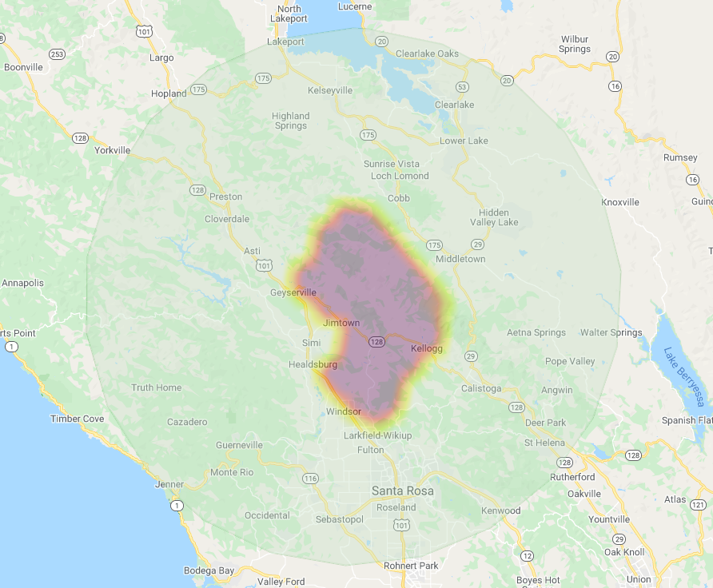

# Description
This project uses the google earth engine to take actual fire data and display it visually on a google earth map. 
The example below shows the 2019 kincade fire in california being used. 

Currently the code generated only works in the google earth engine.

# To Do: 
- Develop jupyter notebook for code
- Develop code to work outside of google earth engine ide

# Installation instructions
- https://developers.google.com/earth-engine/guides/python_install

requires: 
- pip3 install earthengine-api
- pip3 install IPython
- pip3 install jupyterlab
- pip3 install folium

Note, this project will require a google earth account to run

for more visit: https://github.com/google/earthengine-api

